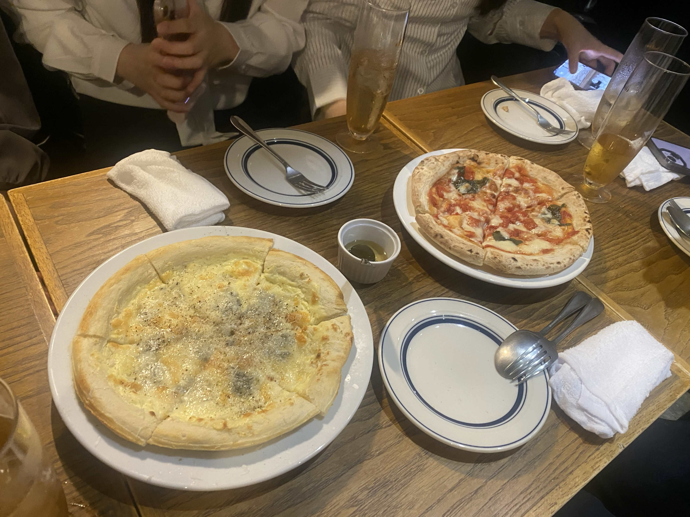

<p align="center">
  
</p>

# PI-ZZA 🍕 — Process Integration & Zonal Search Agent

<p align="center">
  
</p>

<p align="center">
  <a href="https://github.com/clearclown/pizza/actions/workflows/ci.yml"></a>
  <a href="https://github.com/clearclown/pizza/blob/main/LICENSE"></a>
  
  
  <a href="https://conventionalcommits.org"></a>
  
  <a href="https://github.com/clearclown/pizza/pulls"></a>
</p>

<p align="center">
  
</p>

> **「精度の高いデータ、おまち！」**
> PI-ZZA は、OSM Overpass / JFA / 国税庁法人番号 CSV / 公式ページ / 任意の Google Places を組み合わせ、FC 事業会社を根拠付きで集計するロケーション・インテリジェンス・ツールです。

---

## 🍕 プロジェクト概要

フランチャイズ (FC) 業界における**メガフランチャイジー（20 店舗以上の運営会社）**の特定や、**直営・FC の判別**といった、人間が数週間かけて行う泥臭いリサーチ業務を、AI エージェントが数時間で完遂させることを目的としています。

対象は、カーブス / モスバーガー / 業務スーパー / Itto個別指導学院 / エニタイムフィットネス / コメダ珈琲 / シャトレーゼ / ハードオフ / オフハウス / Kids Duo / アップガレージ / カルビ丼とスン豆腐専門店韓丼 / Brand off / TSUTAYA の **14 ブランド × 47 都道府県**。LLM は名称正規化・批評・抽出補助に限定し、ground truth は pipeline が取得した外部 source と国税庁法人番号 CSV で検証します。

## 📊 現在のメガジー成果物 (2026-04-27)

主要成果物は [test/fixtures/megafranchisee/](./test/fixtures/megafranchisee/) に固定スナップショットとして出力します。Google API は任意で、OSM / JFA / 公式ページ / 国税庁 CSV の経路だけでも更新できます。

| ファイル | 行数 | 役割 |
|---|--:|---|
| [`operator-centric-master-14brand-complete.csv`](./test/fixtures/megafranchisee/operator-centric-master-14brand-complete.csv) | 527 | 14 ブランド横持ちの operator-centric master |
| [`fc-operators-all.csv`](./test/fixtures/megafranchisee/fc-operators-all.csv) | 1,005 | 1 事業会社 1 行の集約 master |
| [`fc-links.csv`](./test/fixtures/megafranchisee/fc-links.csv) | 1,432 | brand × operator の根拠付き flat link |
| [`by-view/megajii-ranking.csv`](./test/fixtures/megafranchisee/by-view/megajii-ranking.csv) | 123 | 2 業態以上かつ 20 店舗以上の厳密メガジーランキング |
| [`jfa-disclosures.csv`](./test/fixtures/megafranchisee/jfa-disclosures.csv) | 103 | JFA 情報開示書面 PDF index |

採用 source は `jfa` / `jfa_disclosure` / `manual_megajii_*` / `pipeline` / `osm_overpass` / `official_franchisee_page` / `operator_official_brand_link` などで provenance を保持します。法人番号は `var/houjin/registry.sqlite` の国税庁 CSV で照合できた場合だけ付与します。

再生成の基本コマンド:

```bash
env UV_CACHE_DIR=/tmp/uv-cache UV_NO_SYNC=1 ./bin/pizza osm-fetch-all
env UV_CACHE_DIR=/tmp/uv-cache UV_NO_SYNC=1 ./bin/pizza jfa-sync
env UV_CACHE_DIR=/tmp/uv-cache UV_NO_SYNC=1 ./bin/pizza jfa-disclosure-sync --fetch-pdfs
env UV_CACHE_DIR=/tmp/uv-cache UV_NO_SYNC=1 ./bin/pizza official-franchisee-sources
env UV_CACHE_DIR=/tmp/uv-cache UV_NO_SYNC=1 ./bin/pizza integrate --mode export \
  --out test/fixtures/megafranchisee/fc-links.csv
env UV_CACHE_DIR=/tmp/uv-cache UV_NO_SYNC=1 uv run --project services/delivery \
  python -m pizza_delivery.megafranchisee_clean_export
env UV_CACHE_DIR=/tmp/uv-cache UV_NO_SYNC=1 uv run --project services/delivery \
  python -m pizza_delivery.operator_master_export \
  --min-total 1 \
  --out test/fixtures/megafranchisee/operator-centric-master-14brand-complete.csv
```

## 🧩 アーキテクチャ — 4 つのトッピング

```
┌──────────────────────────────────────────────────────────────────┐
│                  🔥 Oven (Go Orchestrator)                        │
│                  cmd/pizza/ — pizza bake ...                      │
└─────────┬────────────┬───────────────┬─────────────┬─────────────┘
          │ gRPC       │ gRPC          │ REST        │ SQLite
          ▼            ▼               ▼             ▼
   ┌───────────┐ ┌─────────────┐ ┌────────────┐ ┌──────────┐
   │ 🫓 Dough  │ │ 🛵 Courier  │ │ 🧀 Kitchen │ │ 📦 Box   │
   │ Seed (Go) │ │ Delivery    │ │ Firecrawl  │ │ BI       │
   │           │ │ (Python)    │ │ (TS/AGPL)  │ │ (Py)     │
   │ M1        │ │ M3          │ │ M2         │ │ M4       │
   └───────────┘ └──────┬──────┘ └────────────┘ └──────────┘
                        │ Multi-LLM
            ┌───────────┼────────────┐
            ▼           ▼            ▼
       Anthropic    OpenAI        Gemini
```

| # | モジュール | 比喩 | 実装言語 | フォーク元 | ライセンス |
|---|---|---|---|---|---|
| **M1** | **Seed** | 🫓 生地 | **Go** | [gosom/google-maps-scraper](https://github.com/gosom/google-maps-scraper) + [googlemaps/google-maps-services-go](https://github.com/googlemaps/google-maps-services-go) | MIT / Apache-2.0 |
| **M2** | **Kitchen** | 🧀 トッピング | **TypeScript** | [mendableai/firecrawl](https://github.com/mendableai/firecrawl) | **AGPL-3.0** (REST 越境で隔離) |
| **M3** | **Delivery** | 🛵 配達 | **Python** | [browser-use/browser-use](https://github.com/browser-use/browser-use) | MIT |
| **M4** | **Box** | 📦 箱 | **Python (Streamlit + SQLite)** | — (自作) | — |

> **多言語共存 (polyglot)**: Go オーケストレータが gRPC で各モジュールを束ねます。フォーク元 OSS は**元言語のまま**保持し、API 境界で接続します。

---

## 🚀 Quick Bake

```bash
# 1. Clone
git clone git@github.com:clearclown/pizza.git
cd pizza

# 2. 環境構築 (Go / uv / buf / ツール一式)
make bootstrap

# 3. 環境変数
cp .env.example .env              # Google Maps Platform はデフォルト無効

# 4. gRPC コード生成 + Go バイナリビルド
make proto
make build

# 5. テスト
make test                         # Go pkg + pytest 640 pass / 6 skipped (2026-04-27)

# 6. PI-ZZA を焼く (有料 Places API を使う場合だけ明示 opt-in)
PIZZA_ENABLE_PAID_GOOGLE_APIS=1   # 必要な時だけ設定
./bin/pizza bake --query "エニタイムフィットネス" --area "新宿"

# 6b. Expert Panel (Gemini Flash × 2 + Claude critic) で判定
./bin/pizza serve --mode panel &    # gRPC 起動 (別シェル推奨)
./bin/pizza bake --query "エニタイムフィットネス" --area "新宿" \
    --with-judge --judge-mode panel

# 6c. Research Pipeline で operator 深掘り + 広域芋づる式 + 法人番号 verify
./bin/pizza research --brand "エニタイムフィットネス" \
    --expand --expand-area "東京都" --verify-houjin

# 全フラグ確認
./bin/pizza help                  # bake / research / serve の flag 一覧

# 7. BI 可視化
uv run streamlit run cmd/box-ui/app.py
```

**`DELIVERY_MODE` の切替**:
- `mock` (default) — 固定判定で疎通だけ確保。CI / 疎通テスト用
- `live` — `.env` の `ANTHROPIC_API_KEY` (または OpenAI / Gemini) を使って browser-use + LLM で真判定

---

## 🧪 開発フロー — TDD First

本プロジェクトでは **Red → Green → Refactor** を厳守します。

```bash
# 1. 🔴 Red: 失敗するテストだけコミット
git commit -m "test(scoring): add failing test for mega franchisee threshold"

# 2. 🟢 Green: 最小実装でテストを通す
git commit -m "feat(scoring): count stores with 20+ threshold"

# 3. 🔵 Refactor: 構造を整える
git commit -m "refactor(scoring): extract threshold to config"
```

詳細: [CONTRIBUTING.md](./CONTRIBUTING.md) / [docs/tdd-workflow.md](./docs/tdd-workflow.md)

---

## 📁 ディレクトリ構成（抜粋）

```
pizza/
├── api/pizza/v1/        # 🔌 gRPC proto 契約 (buf 管理)
├── cmd/                  # 🏠 バイナリエントリ (pizza, dough-service, delivery-service, box-ui)
├── internal/             # 🍕 Go パッケージ (oven / dough / toppings / courier / box / grid / scoring)
├── services/delivery/    # 🐍 Python browser-use wrapper + Multi-LLM providers
├── gen/                  # 📜 proto 生成物 (go / python / ts)
├── third_party/          # 🍴 upstream OSS のフォーク (git subtree)
├── deploy/               # 🚢 compose.yaml, Dockerfile.*
├── docs/                 # 📖 architecture / tdd / fork-strategy / proto-versioning
├── test/                 # 🧪 E2E (testcontainers-go) + fixtures
└── scripts/              # 🛠 bootstrap.sh / proto.sh / e2e.sh
```

全体像は [ARCHITECTURE.md](./ARCHITECTURE.md) と [docs/architecture.md](./docs/architecture.md) を参照。

---

## 🛠 テックスタック

| Layer | Tool |
|---|---|
| **Orchestrator** | Go 1.22+, gRPC, bufconn, testify, gomock |
| **API 契約** | Protocol Buffers, [buf](https://buf.build) |
| **AI エージェント** | [browser-use](https://github.com/browser-use/browser-use), Anthropic / OpenAI / Gemini SDK |
| **Crawler** | [Firecrawl](https://github.com/mendableai/firecrawl) (REST, セルフホストまたは SaaS) |
| **Maps / Open Data** | OSM Overpass, JFA, 国税庁法人番号 CSV, [gosom/google-maps-scraper](https://github.com/gosom/google-maps-scraper), Google Maps Places API |
| **Python** | 3.11+, [uv](https://github.com/astral-sh/uv), pytest, ruff |
| **BI** | Streamlit + SQLite |
| **CI** | GitHub Actions (ci / buf / codeql / release-please / upstream-sync) |
| **Container** | Docker Compose (podman 互換) |

---

## 🚦 実装状況 (Phase 28 時点)

| 機能 | 状態 | 実測 |
|---|---|---|
| 14 ブランド operator-centric master | 🟢 | 527 operator、14 ブランド全 CSV export |
| FC operator directory | 🟢 | 1,005 operator / 1,432 brand links |
| 厳密メガジーランキング | 🟢 | 123 社、2+業態かつ20+店舗、0 店舗 evidence は除外 |
| OSM Overpass 全国補完 | 🟢 | Google API 不使用の店舗取得経路 |
| JFA 協会員 / 情報開示書面 | 🟢 | 協会員 scrape + PDF index 103 件 |
| 公式ページ source 追加 | 🟢 | 公式FC・運営会社・本部PR本文を国税庁照合付きで ORM 化 |
| Places API scan | 🟡 | 有料 API は `PIZZA_ENABLE_PAID_GOOGLE_APIS=1` の明示 opt-in 時のみ |
| EDINET / gBizINFO | 🟡 | API key 設定後に補完可能 |

詳細な fixture 仕様: [test/fixtures/megafranchisee/README.md](./test/fixtures/megafranchisee/README.md)

## 📚 ドキュメント

- [ARCHITECTURE.md](./ARCHITECTURE.md) — 俯瞰図
- [docs/architecture.md](./docs/architecture.md) — シーケンス図・SQLite スキーマ・gRPC 契約
- [docs/phase0-audit.md](./docs/phase0-audit.md) — Phase 0 完了レポート
- [docs/phase1-audit.md](./docs/phase1-audit.md) — Phase 1 完了 + 残件
- [docs/tdd-workflow.md](./docs/tdd-workflow.md) — Red-Green-Refactor 実例（Go/Python）
- [docs/fork-strategy.md](./docs/fork-strategy.md) — git subtree での upstream 同期
- [docs/license-compliance.md](./docs/license-compliance.md) — AGPL Firecrawl の REST 越境隔離
- [docs/proto-versioning.md](./docs/proto-versioning.md) — buf breaking ポリシー
- [開発工程.md](./開発工程.md) — フェーズ別ロードマップ（日本語原本）
- [CONTRIBUTING.md](./CONTRIBUTING.md) — 貢献ガイド
- [CODE_OF_CONDUCT.md](./CODE_OF_CONDUCT.md) — 行動規範
- [SECURITY.md](./SECURITY.md) — 脆弱性報告
- [English README](./README.en.md)

---

## 🤝 コントリビュート

プルリクエスト歓迎します！ Red → Green → Refactor の TDD サイクルと [Conventional Commits](https://www.conventionalcommits.org/) に従ってください。

Issue は [こちら](https://github.com/clearclown/pizza/issues)、議論は [Discussions](https://github.com/clearclown/pizza/discussions)。

---

## ⚖️ ライセンス

本プロジェクトは [MIT License](./LICENSE) で公開しています — ユーモアと効率を愛するすべてのエンジニアへ。

フォーク元 OSS のライセンスは各リポジトリに従います。Firecrawl は AGPL-3.0 であり、PI-ZZA 本体とはプロセス境界（REST）で分離されています。詳細: [docs/license-compliance.md](./docs/license-compliance.md)。
